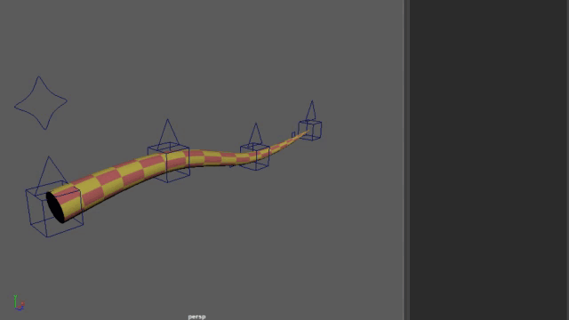

# TwistSpline
A smoothly reparameterizing Bezier spline that also interpolates orientations.

The idea here is to build a header-only C++ template library for the spline, and a reference implementation (maya plugin).

## Demos

This gif demonstrates the smoothly interpolating pin values for this test setup.
Any control can be pinned with an arbitrary value at any time.
Not shown: You can unpin *both ends* as long as at least one control has weight.

This gif deomonstrates the smoothly interpolating twist values (and their interaction with position pinning)
Again, any control can pin its twist value, and twist solves smoothly through length preservation

Not Shown: The Rider node can constrain between multiple splines. This means that a tool could easily be written to build and switch to another spline. For an artist, this would give the ability to add or remove spline controls on the fly in-scene.

## Installation
Download the `TwistSpline-v*.*.*.zip` file from the [latest release](https://github.com/blurstudio/TwistSpline/releases)
Create a `modules` folder in your maya user directory. For example, on Windows, that would mean creating `C:\Users\<your-username>\Documents\maya\modules`. Then copy the `TwistSpline.mod` file and the `TwistSpline` folder into that directory.
This should work for Maya 2022 and later on Windows, Linux, and Mac.

## Compiling
Hopefully you shouldn't have to compile. The [releases](https://github.com/blurstudio/TwistSpline/releases) are kept up-to-date, and include plugins for Maya 2022-2025 on Windows, Linux, and Mac.

If you fork this repo, you can edit the [workflow yaml file](https://raw.githubusercontent.com/blurstudio/TwistSpline/master/.github/workflows/main.yml) to make any changes or add any options you need (PR's welcome)

If you have to compile locally for windows, there's a `mayaConfigure.bat` file that has defaults to build a Visual Studio solution and compile. You may have to edit it a bit to suit your needs, but it should be pretty straightforward. Linux and Mac users can probably use that as a template.

## Usage

Currently, the easiest way to handle building a spline and all of its required connections is to use `twistSplineBuilder.py` and run the `makeTwistSpline` function inside. You will probably have to edit this file to fit in your pipeline.

`makeTwistSpline(prefix, numCVs, numRiders, spread=1, maxParam=None, closed=False, singleTangentNode=True)`

`prefix` is the naming prefix for all the DAG objects.
`numCVs` is the total number of CVs
`numRiders` is the number of evenly spaced locators riding the spline. Locators are used because joints don't show orientation.
`spread` is the amount of space between each controller (cv and tangent). So a spread of 1 makes the CVs 3 apart.
`maxParam` is the parameter value of the last CV. It defaults to (3 * spread * (numCVs - 1))
`closed` is whether the spline will form a closed loop
`singleTangentNode` is whether to use the newer/simpler single node to calculate the automatic tangents

## Node Documentation

See the [Node Documentation](nodeDocs.md) file

